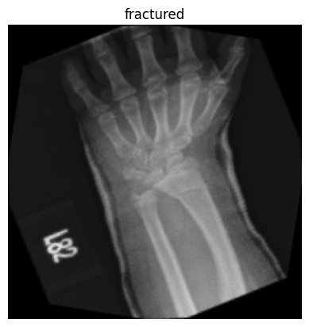
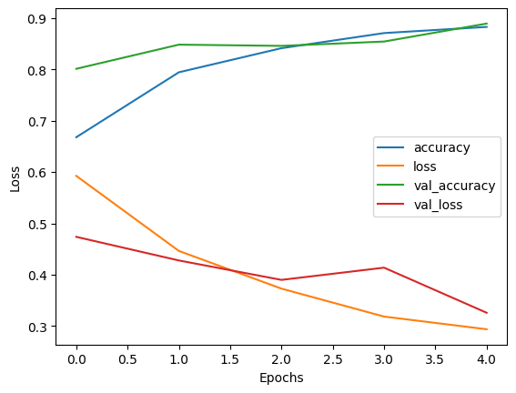

# 🦴 CNN-Bone-Fracture-Detection

## 📌 Project Overview
This project tackles the binary classification of bone X-ray images into two categories:
- **Fractured**
- **Not Fractured**

I used Convolutional Neural Networks (CNNs) for image classification and apply both basic preprocessing and data augmentation techniques to enhance model performance. The model is implemented using **TensorFlow** and **Keras**.

---

## 📁 Dataset Structure
Dataset (from Kaggle) is organized as:

Bone_Fracture_Binary_Classification/ ├── train/ │ ├── fractured/ │ └── not fractured/ ├── test/ │ ├── fractured/ │ └── not fractured/ ├── val/ │ ├── fractured/ │ └── not fractured/

Each subdirectory contains class-specific images. Corrupted images were removed before training using a Python script.

---

## ⚙️ Dependencies
Required libraries:

- `tensorflow`
- `numpy`
- `matplotlib`
- `pandas`
- `PIL`
- `os`, `pathlib`, `imghdr`

Install them via:

- pip install tensorflow numpy matplotlib pandas pillow
🧹 Removing Corrupted Images
To remove incompatible or unreadable image files from train, test, and val, use the script below:

`from pathlib import Path`
`import imghdr`
`import os`

`data_dir = "./train"  # Repeat for ./test and ./val`
`image_extensions = [".png", ".jpg"]`
`img_type_accepted_by_tf = ["bmp", "gif", "jpeg", "png"]`

`for filepath in Path(data_dir).rglob("*"):
    if filepath.suffix.lower() in image_extensions:
        img_type = imghdr.what(filepath)
        if img_type is None or img_type not in img_type_accepted_by_tf:
            os.remove(filepath)`
🖼️ Exploratory Data Analysis
Used to count the number of samples per class and visualize random images:

`def random_img(dirpath, target_class):
    # Load and display a random image from class
    ...`
📷 Example Output:

📊 Data Preprocessing
All pixel values rescaled to [0, 1] using:

`ImageDataGenerator(rescale=1./255)`
Images resized to 224x224 and loaded with:

`flow_from_directory(..., class_mode="binary", target_size=(224,224))`
Batch size: 32

📌 Baseline CNN Model
Basic CNN model architecture:

`Sequential([
    Conv2D(10, 3, activation='relu'),
    Conv2D(10, 3, activation='relu'),
    MaxPool2D(),
    Conv2D(10, 3, activation='relu'),
    Conv2D(10, 3, activation='relu'),
    MaxPool2D(),
    Flatten(),
    Dense(1, activation='sigmoid')
])`
✅ Training
`baseline_model.compile(loss='binary_crossentropy', optimizer='adam', metrics=['accuracy'])
baseline_model.fit(...)`
📉 Loss and Accuracy Plot
`pd.DataFrame(history.history).plot()`
Shows training and validation accuracy/loss for 5 epochs.

🔁 CNN with Data Augmentation
To improve generalization, we added data augmentation:

`ImageDataGenerator(
    rescale=1./255,
    rotation_range=20,
    shear_range=0.2,
    zoom_range=0.2,
    horizontal_flip=True
)`
Model trained with same architecture on augmented data.

✅ Training with Augmentation
`model.fit(train_data_ag, ...)`
📉 Augmented Model Plot
`pd.DataFrame(model.history).plot()`
Shows improved performance after applying data augmentation.

🧪 Evaluation
Both models trained for 5 epochs.

Evaluated on validation set.

Plots were used to compare model performance.

🔍 Results:
Baseline Model: High training and validation accuracy (~0.9) with low loss (~0.1), but slight fluctuations in validation loss indicate marginally less stable generalization.

Augmented Model: Achieves high validation accuracy (~0.9) and low loss (~0.1) with more stable generalization, as seen in smoother validation loss trends compared to the baseline model.

🧠 Conclusions
Developed a working CNN classifier for bone fracture detection.

Boosted model performance using data augmentation.

Preprocessed data by removing corrupted files.

Built reusable image classification pipeline.

📂 Repository Structure

├── cnn01.ipynb              # Main model notebook
├── corruptedTrain.py        # Script for cleaning training images
├── corruptedTest.py         # Script for cleaning test images
├── CorruptedVal.py          # Script for cleaning validation images
└── README.md                # Project documentation
